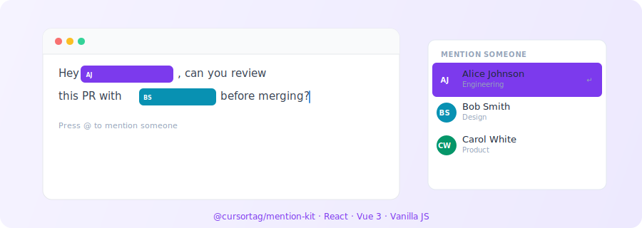

# mention-kit

<p align="center">
  
</p>

<p align="center">
  <strong>Headless, zero-dependency TypeScript mention editor</strong><br/>
  Built on <code>contentEditable</code> — works with React, Vue 3, or vanilla JS.
</p>

<p align="center">
  <a href="https://www.npmjs.com/package/@cursortag/mention-kit"></a>
  <a href="https://github.com/amchuri/mention-kit/blob/main/LICENSE"></a>
  <a href="https://www.npmjs.com/package/@cursortag/mention-kit"></a>
  <a href="https://amchuri.github.io/mention-kit/"></a>
</p>

<!-- To add a demo GIF: record a ~15s screen capture of the editor, save as media/demo.gif, then uncomment:
<p align="center">
  
</p>
-->

---

## Features

- **Zero dependencies** — no framework required for the core
- **Dual CJS + ESM** builds with full TypeScript types
- **React** — `<MentionInput />` component and `useMentionEditor()` hook
- **Vue 3** — `<MentionInput />` component and `useMentionEditor()` composable
- **Headless** — renders a plain `<div>`, style with Tailwind / MUI / shadcn / anything
- **Keyboard-first** — `@` to open, `↑↓` to navigate, `Enter`/`Tab` to select, `Escape` to close
- **Simple callbacks** — `onSubmit` gives you `text` directly, plus `nodes` and `mentionedUsers` in `meta`
- **Custom palettes** — per-user colors or a shared palette
- **Persistence format** — `@{userId}` tokens for easy storage and re-render

---

## Installation

```bash
# npm
npm install @cursortag/mention-kit

# yarn
yarn add @cursortag/mention-kit

# pnpm
pnpm add @cursortag/mention-kit
```

React and Vue are optional peer dependencies — install only what you use:

```bash
# React
yarn add @cursortag/mention-kit react

# Vue
yarn add @cursortag/mention-kit vue
```

---

## Quick start

### React

```tsx
import { MentionInput } from '@cursortag/mention-kit/react';

const users = [
  { id: 'u1', name: 'Alice Johnson', meta: 'Engineering' },
  { id: 'u2', name: 'Bob Smith', meta: 'Design' },
];

function CommentBox() {
  return (
    <MentionInput
      users={users}
      placeholder="Write a comment… (@ to mention)"
      onSubmit={(text) => console.log(text)}
      className="rounded border p-2 min-h-[80px]"
    />
  );
}
```

### Vue 3

```vue
<script setup lang="ts">
import { MentionInput } from '@cursortag/mention-kit/vue';

const users = [
  { id: 'u1', name: 'Alice Johnson', meta: 'Engineering' },
  { id: 'u2', name: 'Bob Smith', meta: 'Design' },
];
</script>

<template>
  <MentionInput
    :users="users"
    placeholder="Write a comment…"
    class="rounded border p-2 min-h-[80px]"
    @submit="(text) => console.log(text)"
  />
</template>
```

### Vanilla JS

```ts
import { createMentionEditor } from '@cursortag/mention-kit';

const editor = createMentionEditor({
  container: document.getElementById('editor')!,
  users: [
    { id: 'u1', name: 'Alice Johnson' },
    { id: 'u2', name: 'Bob Smith' },
  ],
  placeholder: 'Write a comment…',
  onSubmit: (text, { mentionedUsers }) => {
    console.log(text); // "Hey @Alice Johnson, check this"
    console.log(mentionedUsers); // [{ id: 'u1', name: 'Alice Johnson', ... }]
  },
});

// Cleanup
editor.destroy();
```

---

## Callback signature

All callbacks receive `text` as the first argument and an optional `meta` object as the second:

```ts
onChange?: (text: string, meta: EditorCallbackMeta) => void;
onSubmit?: (text: string, meta: EditorCallbackMeta) => void;
```

| Argument              | Type            | Description                                          |
| --------------------- | --------------- | ---------------------------------------------------- |
| `text`                | `string`        | Plain text with mentions as `@displayName`           |
| `meta.nodes`          | `EditorNode[]`  | Full structured document (for storage/serialization) |
| `meta.mentionedUsers` | `MentionUser[]` | De-duplicated list of mentioned users                |

**Simple usage** — just use `text`:

```tsx
onSubmit={(text) => saveComment(text)}
```

**Power-user usage** — destructure `meta` when needed:

```tsx
onSubmit={(text, { nodes, mentionedUsers }) => {
  saveComment(text);
  notifyUsers(mentionedUsers.map(u => u.id));
  storeNodes(nodes); // for re-rendering later
}}
```

---

## React

### `<MentionInput />` — drop-in component

```tsx
import { useRef } from 'react';
import {
  MentionInput,
  type MentionEditorInstance,
} from '@cursortag/mention-kit/react';

function CommentBox() {
  const ref = useRef<MentionEditorInstance>(null);

  return (
    <>
      <MentionInput
        ref={ref}
        users={users}
        placeholder="Write a comment…"
        onSubmit={(text, { mentionedUsers }) => {
          console.log(text, mentionedUsers);
          ref.current?.clear();
        }}
        className="rounded border border-gray-300 p-3 min-h-[80px] text-sm"
      />
      <button onClick={() => ref.current?.clear()}>Clear</button>
    </>
  );
}
```

**Props**

| Prop             | Type                              | Description                       |
| ---------------- | --------------------------------- | --------------------------------- |
| `users`          | `MentionUser[]`                   | List of mentionable users         |
| `placeholder`    | `string`                          | Placeholder text                  |
| `onSubmit`       | `(text, meta) => void`            | Called on `Enter`                 |
| `onChange`       | `(text, meta) => void`            | Called on every edit              |
| `disabled`       | `boolean`                         | Disables editing                  |
| `maxSuggestions` | `number`                          | Max dropdown items (default `8`)  |
| `palette`        | `string[]`                        | Fallback colors for user chips    |
| `defaultNodes`   | `EditorNode[]`                    | Initial content                   |
| `className`      | `string`                          | CSS class on the container div    |
| `style`          | `CSSProperties`                   | Inline style on the container div |
| `renderUser`     | `(user, selected) => HTMLElement` | Custom dropdown row renderer      |

**Ref methods** (`useRef<MentionEditorInstance>`)

| Method                   | Description                                     |
| ------------------------ | ----------------------------------------------- |
| `getNodes()`             | Returns current document as `EditorNode[]`      |
| `setNodes(nodes, emit?)` | Replace content; pass `true` to fire `onChange` |
| `clear()`                | Clear all content                               |
| `focus()`                | Move focus into the editor                      |
| `setPlaceholder(text)`   | Update placeholder after mount                  |

---

### `useMentionEditor()` — hook for custom containers

Use this when you need to embed the editor inside a MUI `<Box>`, shadcn `<Textarea>`, or any element you control.

```tsx
import { useMentionEditor } from '@cursortag/mention-kit/react';

function MyEditor() {
  const editor = useMentionEditor({
    users,
    onChange: (text) => console.log(text),
    onSubmit: (text) => {
      save(text);
      editor.clear();
    },
  });

  return (
    <div
      ref={editor.containerRef}
      className="rounded border border-gray-300 p-3 min-h-[80px]"
    />
  );
}
```

**MUI example**

```tsx
<Box
  ref={editor.containerRef}
  sx={{
    border: 1,
    borderColor: 'divider',
    borderRadius: 1,
    p: 1.5,
    minHeight: 80,
  }}
/>
```

**shadcn / Radix example**

```tsx
<div
  ref={editor.containerRef}
  className={cn(
    'flex min-h-[80px] w-full rounded-md border border-input bg-background px-3 py-2 text-sm',
    'ring-offset-background focus-within:ring-2 focus-within:ring-ring',
  )}
/>
```

**Returns**

| Field                    | Type                  | Description                      |
| ------------------------ | --------------------- | -------------------------------- |
| `containerRef`           | `Ref<HTMLDivElement>` | Attach to your container element |
| `getNodes()`             | `() => EditorNode[]`  | Read current content             |
| `setNodes(nodes, emit?)` | `function`            | Replace content                  |
| `clear()`                | `function`            | Clear all content                |
| `focus()`                | `function`            | Focus the editor                 |
| `setPlaceholder(text)`   | `function`            | Update placeholder               |

---

## Vue 3

### `<MentionInput />` — drop-in component

```vue
<script setup lang="ts">
import { ref } from 'vue';
import {
  MentionInput,
  type MentionEditorInstance,
} from '@cursortag/mention-kit/vue';

const editorRef = ref<MentionEditorInstance | null>(null);
</script>

<template>
  <MentionInput
    ref="editorRef"
    :users="users"
    placeholder="Write a comment…"
    class="rounded border border-gray-300 p-3 min-h-[80px] text-sm"
    @submit="
      (text) => {
        save(text);
        editorRef?.clear();
      }
    "
    @change="(text) => console.log(text)"
  />
  <button @click="editorRef?.clear()">Clear</button>
</template>
```

**Props**

| Prop             | Type            | Description                      |
| ---------------- | --------------- | -------------------------------- |
| `users`          | `MentionUser[]` | List of mentionable users        |
| `placeholder`    | `string`        | Placeholder text                 |
| `disabled`       | `boolean`       | Disables editing                 |
| `maxSuggestions` | `number`        | Max dropdown items (default `8`) |
| `palette`        | `string[]`      | Fallback colors for user chips   |
| `defaultNodes`   | `EditorNode[]`  | Initial content                  |

**Emits**

| Event    | Arguments                                  | Description         |
| -------- | ------------------------------------------ | ------------------- |
| `change` | `(text: string, meta: EditorCallbackMeta)` | Fires on every edit |
| `submit` | `(text: string, meta: EditorCallbackMeta)` | Fires on `Enter`    |

**Exposed methods** (via template ref)

Same as the React ref methods — `getNodes`, `setNodes`, `clear`, `focus`, `setPlaceholder`.

---

### `useMentionEditor()` — composable for custom containers

```vue
<script setup lang="ts">
import { computed } from 'vue';
import { useMentionEditor } from '@cursortag/mention-kit/vue';

const editor = useMentionEditor({
  get users() {
    return filteredUsers.value;
  },
  onSubmit: (text) => {
    save(text);
    editor.clear();
  },
});
</script>

<template>
  <div ref="editor.containerRef" class="rounded border p-3 min-h-[80px]" />
</template>
```

**Element Plus example**

```vue
<el-input :ref="editor.containerRef" type="textarea" :rows="3" />
```

**Vuetify example**

```vue
<v-textarea :ref="editor.containerRef" variant="outlined" />
```

---

## Utility functions

These are standalone exports — use them anywhere, no editor instance needed.

### `serializeToText(nodes)`

Converts an `EditorNode[]` to a plain text string. Mentions become `@displayName`.

```ts
import { serializeToText } from '@cursortag/mention-kit';

const text = serializeToText(nodes);
// "Hey @Alice Johnson, check this PR"
```

### `serializeToMarkdown(nodes)`

Converts an `EditorNode[]` to a markdown-style string with user IDs. Best for storage — you can re-render it later.

```ts
import { serializeToMarkdown } from '@cursortag/mention-kit';

const md = serializeToMarkdown(nodes);
// "Hey @[Alice Johnson](u1), check this PR"
```

### `renderCommentMessage(message, users, palette?)`

Takes a stored `@{userId}` message string and returns an array of text strings and `HTMLElement` chips. Use this to display stored messages in a non-editable context.

```ts
import { renderCommentMessage } from '@cursortag/mention-kit';

const stored = 'Great work @{u1}, please check with @{u2}';
const parts = renderCommentMessage(stored, users);
// [ 'Great work ', <span>Alice Johnson</span>, ', please check with ', <span>Bob Smith</span>, '' ]

// Append to DOM
parts.forEach((part) => {
  container.appendChild(
    typeof part === 'string' ? document.createTextNode(part) : part,
  );
});
```

### `renderCommentMessageToHTML(message, users, palette?)`

Same as `renderCommentMessage`, but returns a single HTML string. Great for emails, server-side rendering, or `dangerouslySetInnerHTML`.

```ts
import { renderCommentMessageToHTML } from '@cursortag/mention-kit';

const html = renderCommentMessageToHTML('Hey @{u1}!', users);
// '<span style="...">Alice Johnson</span>'

// In React (use with caution):
<div dangerouslySetInnerHTML={{ __html: html }} />
```

### `DEFAULT_MENTION_PALETTE`

The built-in array of hex colors used when a user has no `color` property. Export it to extend or override.

```ts
import { DEFAULT_MENTION_PALETTE } from '@cursortag/mention-kit';

// Extend with your brand colors
const palette = [...DEFAULT_MENTION_PALETTE, '#f59e0b', '#ec4899'];

createMentionEditor({ ..., palette });
```

---

## Persistence

Mentions are stored as `@{userId}` tokens. Save the serialised string and re-render it later:

```ts
import { serializeToMarkdown, renderCommentMessageToHTML } from '@cursortag/mention-kit';

// 1. User submits a comment — store the markdown
onSubmit={(text, { nodes }) => {
  const stored = serializeToMarkdown(nodes);
  // "Great work @[Alice Johnson](u1), please check with @[Bob Smith](u2)."
  db.save(stored);
}}

// 2. Later, re-render the stored string to HTML
const html = renderCommentMessageToHTML(stored, users);
```

---

## Keyboard shortcuts

| Key             | Action                              |
| --------------- | ----------------------------------- |
| `@`             | Open mention dropdown               |
| `↑` / `↓`       | Navigate dropdown                   |
| `Enter` / `Tab` | Select highlighted user             |
| `Escape`        | Close dropdown                      |
| `Enter`         | Submit (calls `onSubmit`)           |
| `Shift+Enter`   | Insert newline                      |
| `Backspace`     | On chip: shrinks name, then removes |

---

## Custom palette

```ts
import { DEFAULT_MENTION_PALETTE } from '@cursortag/mention-kit';

// Custom palette
createMentionEditor({ ..., palette: ['#e11d48', '#0ea5e9', '#16a34a'] });

// Extend the default
createMentionEditor({ ..., palette: [...DEFAULT_MENTION_PALETTE, '#f59e0b'] });

// Per-user color (takes precedence over palette)
const users = [{ id: 'u1', name: 'Alice', color: '#7c3aed' }];
```

---

## API reference

### Core (`@cursortag/mention-kit`)

| Export                                             | Description                                  |
| -------------------------------------------------- | -------------------------------------------- |
| `createMentionEditor(opts)`                        | Creates a vanilla editor instance            |
| `serializeToText(nodes)`                           | Nodes to plain text string                   |
| `serializeToMarkdown(nodes)`                       | Nodes to `@[name](id)` markdown string       |
| `renderCommentMessage(msg, users, palette?)`       | Stored string to `(string \| HTMLElement)[]` |
| `renderCommentMessageToHTML(msg, users, palette?)` | Stored string to HTML string                 |
| `DEFAULT_MENTION_PALETTE`                          | Built-in color array                         |

### Types

```ts
interface MentionUser {
  id: string;
  name: string;
  avatar?: string; // URL — shown in chip avatar
  meta?: string; // Subtitle shown in dropdown
  color?: string; // CSS color — overrides palette
  [key: string]: unknown;
}

type TextNode = { type: 'text'; text: string };
type MentionNode = { type: 'mention'; user: MentionUser; displayName: string };
type EditorNode = TextNode | MentionNode;

interface EditorCallbackMeta {
  nodes: EditorNode[];
  mentionedUsers: MentionUser[];
}

interface MentionEditorInstance {
  getNodes: () => EditorNode[];
  setNodes: (nodes: EditorNode[], emit?: boolean) => void;
  focus: () => void;
  clear: () => void;
  destroy: () => void;
  setPlaceholder: (text: string) => void;
}
```

---

## Examples

Full runnable examples live in [`examples/`](./examples):

| File                                                                     | What it shows                                                                   |
| ------------------------------------------------------------------------ | ------------------------------------------------------------------------------- |
| [`examples/react/basic.tsx`](./examples/react/basic.tsx)                 | Drop-in `<MentionInput>`, submit text + mentionedUsers, clear                   |
| [`examples/react/with-hook.tsx`](./examples/react/with-hook.tsx)         | `useMentionEditor` hook, custom container, toolbar, live text + mentioned users |
| [`examples/react/with-mui.tsx`](./examples/react/with-mui.tsx)           | MUI `<Box>` shell, send button                                                  |
| [`examples/vue/basic.vue`](./examples/vue/basic.vue)                     | Drop-in `<MentionInput>`, `@submit`/`@change` emits                             |
| [`examples/vue/with-composable.vue`](./examples/vue/with-composable.vue) | `useMentionEditor`, reactive computed users, team filter                        |

---

## License

MIT (c) [Amay Churi](https://github.com/amchuri)
